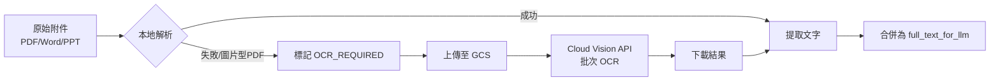
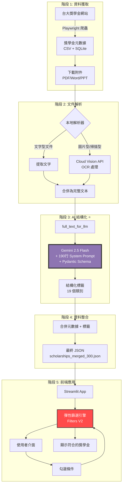

# 🎓 NTU Scholarship Finder

> **借用 AI 的力量彌平資訊落差，讓有需求者不錯過任何機會！**

[](https://streamlit.io/)
[](https://www.python.org/)
[](https://cloud.google.com/)
[](https://deepmind.google/technologies/gemini/)

---

## 📖 目錄

- [專題初衷](#-專題初衷)
- [技術架構](#-技術架構)
- [專案結構](#-專案結構)
- [核心功能](#-核心功能)
- [技術亮點](#-技術亮點)
- [系統流程圖](#-系統流程圖)
- [已知限制](#-已知限制)
- [安裝與使用](#-安裝與使用)
- [未來展望](#-未來展望)
- [商業模式構想](#-商業模式構想)
- [授權](#-授權)

---

## 💡 專題初衷

### 問題背景

在台灣大學，每年有超過 **300 項獎學金**公告，但學生常因以下原因錯失機會：

1. **資訊分散**：獎學金公告散落在不同網頁，格式不一
2. **條件複雜**：每項獎學金的資格要求冗長且專業術語多
3. **搜尋困難**：缺乏有效的篩選工具，學生需逐一閱讀數百份文件
4. **時間壓力**：申請截止日期緊迫，學生容易遺漏適合的機會

### 解決方案

**NTU Scholarship Finder** 透過 **AI 深度解析** 與 **智慧篩選系統**，將雜亂的獎學金資訊轉化為結構化資料，讓學生只需勾選自身條件，即可找到所有符合資格的獎學金。

---

## 🏗️ 技術架構

### 核心技術棧

| 技術領域 | 使用技術 |
|---------|---------|
| **前端框架** | Streamlit |
| **爬蟲引擎** | Playwright + BeautifulSoup4 |
| **文件解析** | pdfplumber, python-docx, odfpy, python-pptx |
| **OCR 服務** | Google Cloud Vision API (批次非同步處理) |
| **AI 模型** | **Gemini 2.5 Flash** (Vertex AI) |
| **Schema 驗證** | Pydantic |
| **資料處理** | Pandas, NumPy |
| **資料庫** | SQLite, JSON |

### AI 在專案中的關鍵角色

本專案的核心創新在於使用 **Gemini 2.5 Flash** 進行**大規模非結構化文本的結構化處理**：

#### 1. **定義 19 維度標籤系統**
```python
CATEGORIES = Literal[
    "學制", "年級", "學籍狀態", "學院", 
    "國籍身分", "設籍地", "就讀地", 
    "特殊身份", "家庭境遇", "經濟相關證明", 
    "核心學業要求", "操行/品德", "特殊能力/專長",
    "補助/獎學金排斥", "領獎學金後的義務", 
    "獎助金額", "獎助名額", "應繳文件",
    "其他（用於無法歸類的特殊要求）"
]
```

#### 2. **190 行超詳細 System Prompt**
教導 AI 如何：
- 識別獎學金中的多個申請組別
- 拆分複合條件（如「低收入戶或清寒證明」→ 拆成兩個獨立標籤）
- 處理否定邏輯（如「不含延畢生」→ 映射為「在學生」）
- 提取並標準化數值資訊（金額、名額、GPA、排名）
- 推論隱含條件（如提及「戶籍」→ 推論為「本國籍」）

#### 3. **Pydantic Schema 強制驗證**
```python
class SubTag(BaseModel):
    tag_category: CATEGORIES
    condition_type: Literal["限於", "包含", "屬性"]
    tag_value: str  # 原始文字
    standardized_value: Optional[str]  # 標準化值
    numerical: Optional[NumericalAttributes]  # 數值資料
```

確保 AI 輸出的 JSON 100% 符合前端需求，避免解析錯誤。

---

## 📂 專案結構

```
new_scholarship/
├── README.md                           # 專案主要說明文件
├── requirements.txt                    # Python 套件依賴
├── app/                                # 前端應用程式
│   ├── app.py                          # Streamlit 主程式
│   ├── filters.py                      # 彈性篩選邏輯
│   ├── ui_components.py                # UI 元件（Tooltip、Grid 等）
│   ├── data_loader.py                  # 資料載入器
│   ├── constants.py                    # 常數定義（篩選選項、匯率等）
│   ├── utils.py                        # 工具函數
│   └── styles.css                      # 自訂樣式
│
├── scripts/                            # 資料處理腳本
│   ├── get_data/                       # 階段 1-4：資料獲取與解析
│   │   ├── scrape_scholarships.py      # 步驟 1：爬取獎學金列表
│   │   ├── download_attachments.py     # 步驟 2：下載官網提供之附件
│   │   ├── document_parsing_and_OCR_staging.py  # 步驟 3：本地文件解析 & 標註需 OCR 之文件
│   │   └── cloud_ocr_processor.py      # 步驟 4：Cloud OCR 處理
│   │
│   ├── data_processing/                # 階段 5-6：資料整合
│   │   ├── merge_scholarships_attachments.py  # 步驟 5：合併附件與元數據
│   │   ├── create_full_text_for_llm.py        # 步驟 6：創建 LLM 輸入文本
│   │   └── merge_tags_with_metadata.py        # 步驟 8：最終合併
│   │
│   └── data_analysis/                  # 階段 7：AI 標籤處理
│       └── tag_processor_batch.py      # 步驟 7：AI 批次標籤處理（Gemini 2.5 Flash）
│
├── data/                               # 資料儲存（分階段處理）
│   ├── raw/                            # 原始資料（爬蟲結果 + 下載的附件）
│   ├── processed/                      # 處理後資料（解析文本 + OCR 結果）
│   ├── analysis/                       # AI 分析結果（300 個 JSON 檔案）
│   └── merged/                         # 最終整合資料
│       └── scholarships_merged_300.json  # 完整的 300 筆獎學金資料
│
└── docs/                               # 詳細文件
    ├── proposal.md                     # 專題提案文件
    └── SCRAPER_USAGE.md                # 爬蟲詳細使用說明
```

### 🔄 資料處理流程對照

| 步驟 | 腳本檔案 | 輸入 | 輸出 |
|------|---------|------|------|
| 1️⃣ | `scrape_scholarships.py` | 台大獎學金網站 | 獎學金元數據（CSV + SQLite） |
| 2️⃣ | `download_attachments.py` | 元數據中的附件連結 | 本地附件檔案（PDF/Word/PPT） |
| 3️⃣ | `document_parsing_and_OCR_staging.py` | 本地附件檔案 | 解析文本 + OCR 需求標記 |
| 4️⃣ | `cloud_ocr_processor.py` | 需 OCR 的檔案 | OCR 解析文本 |
| 5️⃣ | `merge_scholarships_attachments.py` | 元數據 + 解析文本 | 整合 JSON |
| 6️⃣ | `create_full_text_for_llm.py` | 整合 JSON | `full_text_for_llm` 欄位 |
| 7️⃣ | `tag_processor_batch.py` | `full_text_for_llm` | AI 結構化標籤（19 類別） |
| 8️⃣ | `merge_tags_with_metadata.py` | 元數據 + AI 標籤 | **最終資料** |

---

## ✨ 核心功能

### 1. **智慧篩選系統**

#### 📋 篩選邏輯
- **同類別內（OR 邏輯）**：選「大學 + 碩士」→ 顯示兩者皆可申請的獎學金
- **跨類別間（AND 邏輯）**：選「工學院 + 一年級」→ 只顯示同時符合兩者的獎學金
- **包容性設計**：未標註 = 不限制 = 顯示給使用者

#### 🎯 特殊處理

**「不限/未明定」vs「未提及」的差異：**
- **「不限」**：獎學金**明確標註**「不限制」該條件（如「國籍身分：不限」）
  - 選擇此選項 = 包含確定沒有限制的獎學金
- **「未明定/未提及」**：獎學金公告中**完全沒有提到**該條件
  - 選擇此選項 = 包含可能有隱含限制但未明確標註的獎學金
  - ⚠️ **建議**：申請前務必查看官方公告，確認是否有隱含限制

**其他智慧處理：**
- **否定條件智慧處理**：AI 自動將「不含 X」轉換為「限於非 X」

### 2. **原始資訊追溯**

- 將滑鼠移到帶有 <span style="border-bottom: 2px dotted #D9B91A;">點點底線</span> 的文字上
- 即可查看 AI 處理前的原始獎學金內容
- 確保資訊透明度與可信度

### 3. **多維度排序**

- **按金額排序**：優先顯示高額獎學金
- **按截止日期排序**：避免錯過申請時間

### 4. **關鍵字搜尋**

- 支援在獎學金名稱、資格條件中搜尋
- 不區分大小寫，快速定位目標

---

## 🚀 技術亮點

### 1. **多模態文件解析管線**



**技術細節**：
- 使用 `pdfplumber` 處理文字型 PDF（速度快、免費）
- 對於掃描型 PDF，自動切換至 **Google Cloud Vision API**
- 實現**智慧斷點續傳**：檢查 GCS 上的現有結果，避免重複處理
- 支援 **批次非同步處理**，大幅提升效率

### 2. **AI 結構化引擎**

```python
# 處理單筆獎學金
response = client.models.generate_content(
    model='gemini-2.5-flash',
    contents=[{
        "role": "user", 
        "parts": [{"text": f"請根據以下資料生成結構化標籤：\n\n{full_text}"}]
    }],
    config=types.GenerateContentConfig(
        system_instruction=SYSTEM_PROMPT,  # 190 行的詳細指令
        response_mime_type="application/json",
        response_schema=FINAL_SCHEMA_PYDANTIC,  # Pydantic Schema
    ),
)

# 驗證輸出
tags_object = FinalTagsStructure.model_validate_json(response.text)
```

**創新點**：
- **Schema-Guided Generation**：強制 AI 輸出符合 Pydantic 定義的 JSON
- **Zero-Shot Learning**：無需訓練資料，僅透過 Prompt Engineering 達成高準確度
- **批次處理**：自動處理 300+ 獎學金，支援斷點續傳

### 3. **彈性篩選邏輯 (944 行)**

```python
def check_group_match(group: Dict, filters: Dict) -> bool:
    """
    核心過濾邏輯：
    1. 檢查一般條件（學制、年級、學院等）- 包容性邏輯
    2. 檢查特殊條件（身分、經濟證明等）- 白名單邏輯
    3. 處理否定條件（排除不符合的使用者）
    4. 處理「不限/未明定」和「未提及」的語意差異
    """
    # ... 944 行的精密邏輯
```

**設計哲學**：
- **使用者中心**：「我符合這個條件，請幫我找出我可以申請的獎學金」
- **包容性優先**：未標註 = （可能）不限制 = 顯示
- **精準匹配**：特殊身分、經濟證明等採用嚴格匹配，避免誤導

---

## 📊 系統流程圖



### 🔑 AI 關鍵節點說明

**階段 3: AI 結構化** 是整個系統的核心創新：

1. **輸入**：包含網站公告 + 附件解析文本的 `full_text_for_llm`（最長可達 20,000+ 字元）
2. **處理**：
   - Gemini 2.5 Flash 根據 190 行的 System Prompt 進行深度解析
   - 識別單筆獎學金中的多個申請組別（如「清寒組」、「優秀組」）
   - 將每個條件歸類到 19 個標籤類別
   - **標準化條件值**：將原始文字（`tag_value`）映射為標準化值（`standardized_value`）
     - 例如：「家境清寒」→ 根據上下文映射為特定的官方證明文件，如「低收入戶證明」或「村里長提供之清寒證明」
     - 例如：「不含延畢生」→ 映射為「在學生」（處理否定邏輯）
   - 提取數值資訊（金額、名額、GPA）並標準化
   - 處理否定邏輯與隱含推論
3. **輸出**：符合 Pydantic Schema 的結構化 JSON，包含：
   - `groups`: 各申請組別的條件列表
   - `common_tags`: 適用於所有組別的通用條件
   - 每個標籤包含：`tag_category`, `condition_type`, `tag_value`, `standardized_value`, `numerical`

---

## ⚠️ 已知限制

### 1. **無法處理僅提供外部網站連結的獎學金**

**問題說明**：
- 部分獎學金公告僅提供外部網站連結（如系所網站、基金會官網），而未提供 PDF/Word 等可下載的附件檔案
- 目前系統僅能解析**可下載的附件檔案**（PDF、Word、PPT 等），無法自動爬取並解析外部網站內容

**影響範圍**：
- 部分獎學金因僅提供外部連結而無法完整解析
- 這些獎學金在系統中會顯示「詳見官方公告」，但無法提供詳細的篩選標籤

**未來改善方向**：
- 實現**網頁內容爬取與解析**功能
- 使用 Playwright 自動訪問外部連結
- 將網頁內容納入 AI 結構化處理流程

### 2. **AI 標籤準確率限制**

**問題說明**：
- AI 自動標籤雖然大幅提升了資訊整理效率，但仍可能在少數案例中出現誤判
- 特別是在處理模糊或矛盾的條件描述時

**建議使用方式**：
- 使用者可透過 **Hover 查看原始資訊** 功能，確認 AI 處理結果
- 亦可透過 **回報錯誤** 功能，向網站管理者反映錯誤資訊
- 申請前務必點擊「官方公告」連結，確認完整資格條件

---

## 🛠️ 安裝與使用

### 前置需求

- Python 3.8+
- Google Cloud Platform 帳號（用於 Vision API 和 Vertex AI）
- Playwright 瀏覽器驅動

### 安裝步驟

1. **Clone 專案**
```bash
git clone https://github.com/yourusername/ntu-scholarship-finder.git
cd ntu-scholarship-finder
```

2. **建立虛擬環境**
```bash
python -m venv venv
source venv/bin/activate  # Windows: venv\Scripts\activate
```

3. **安裝相依套件**
```bash
pip install -r requirements.txt
playwright install chromium
```

4. **設定 Google Cloud 憑證**
```bash
# 設定環境變數
export GOOGLE_APPLICATION_CREDENTIALS="/path/to/your/service-account-key.json"
export GCP_PROJECT_ID="your-project-id"
export GCP_REGION="us-central1"
```

### 執行應用程式

```bash
streamlit run app/app.py
```

應用程式將在 `http://localhost:8501` 啟動。

### 資料處理流程（可選）

如果您想要重新爬取和處理資料：

```bash
# 1. 爬取獎學金列表
python scripts/get_data/scrape_scholarships.py --max-pages 20

# 💡 詳細的爬蟲使用說明（參數、錯誤處理、斷點續爬等），請參考 docs/SCRAPER_USAGE.md

# 2. 下載附件
python scripts/get_data/download_attachments.py

# 3. 本地文件解析
python scripts/get_data/document_parsing_and_OCR_staging.py

# 4. Cloud OCR 處理（需要 GCP 憑證）
python scripts/get_data/cloud_ocr_processor.py

# 5. 合併附件與元數據
python scripts/data_processing/merge_scholarships_attachments.py

# 6. 創建 LLM 輸入文本
python scripts/data_processing/create_full_text_for_llm.py

# 7. AI 批次標籤處理
python scripts/data_analysis/tag_processor_batch.py

# 8. 最終合併
python scripts/data_processing/merge_tags_with_metadata.py
```

---

## 🔮 未來展望

### 短期目標（3-6 個月）

1. **即時資料更新**
   - 實現每日自動爬取新公告
   - 建立 Webhook 通知系統，當有新獎學金時推送給使用者

2. **個人化推薦**
   - 使用者建立個人檔案（學制、年級、學院等）
   - AI 主動推薦最適合的獎學金
   - 提供申請截止日期提醒

3. **申請輔助功能**
   - 自動生成申請文件檢查清單

### 中期目標（6-12 個月）

1. **B2B 服務**
   - 與各系學生輔導中心合作
   - 提供 API 或嵌入式 Widget
   - 協助輔導專員快速為學生匹配資源

2. **多語言支援**
   - 支援英文介面（服務國際學生）
   - AI 自動翻譯獎學金公告

### 長期願景（1-2 年）

1. **社會影響力**
   - 降低教育資源的資訊落差
   - 協助弱勢學生找到更多機會
   - 推動教育公平

---

## 🎯 商業模式構想

### B2B2C 模式

**目標客戶**：大學學生事務處、各系學生輔導中心

**價值主張**：
- 協助輔導專員快速為學生匹配資源，提升服務效率 **10 倍**
- 減少學生諮詢時間，讓專員專注於更高價值的輔導工作
- 提供數據分析，了解學生需求與獎學金使用率

**收費模式**：
- **免費版**：學生個人使用，基本篩選功能
- **專業版**：學校單位訂閱，提供 API、數據分析、客製化功能

---

## 📄 授權

**Copyright © 2025 [8ihc](https://github.com/8ihc). All Rights Reserved.**

本專案為學術專題作品，目前**保留所有權利**。未經作者明確書面許可，不得使用、複製、修改或分發本專案的任何部分。

如有合作或授權需求，請聯絡作者。

---

<div align="center">

**讓每個學生都能找到屬於自己的機會 🎓**

Made with ❤️ by [8ihc](https://github.com/8ihc)

</div>
